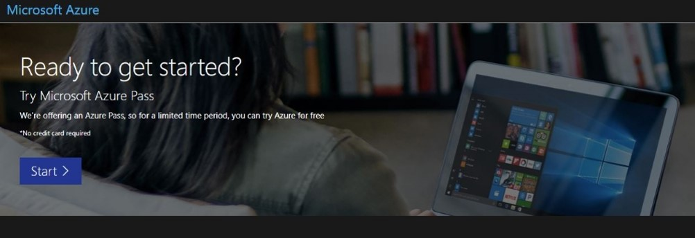
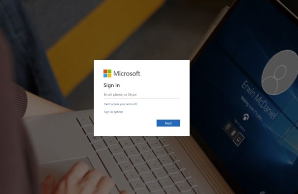
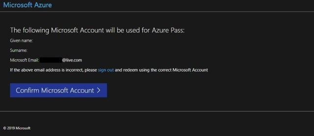
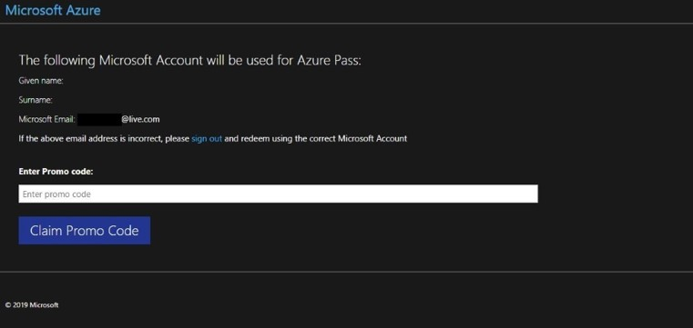
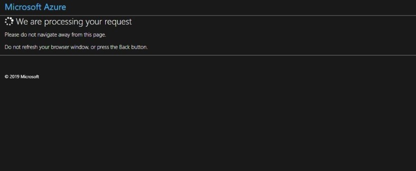
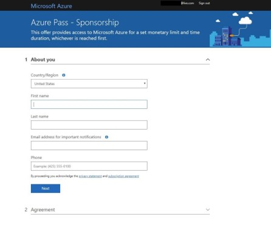
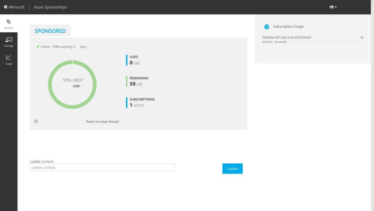

---
wts:
    title: 'Activate the Azure Pass'   
    module: 'Start'
---
# Activate the Azure Pass (10min)

In this walkthrough you will learn how to activate the Azure Pass. 

Your personal Azure Pass code (Promo Code) is:
```
(AzurePassCode)
```
> **Warning:** Do not share the Azure Pass code with anyone else. This is a personal Azure Pass code that is only provided to you. Each Azure Pass code can only be activated one time.


# Task 1: Activate 
1. Open the Website **https://www.microsoftazurepass.com** and click on **Start**
   
   

2. Log in with your Microsoft account. 
   
    

    >**Attention**: Do not use your corporate work account. If you do not have a Microsoft account create one: **https://support.microsoft.com/en-us/account-billing/how-to-create-a-new-microsoft-account-a84675c3-3e9e-17cf-2911-3d56b15c0aaf**

3. Check if you have selected the correct account and click on **Confirm Microsoft Account**
   
   

4. Enter your Promo Code and click on **Claim Promo Code**
   
   

5. The Claiming process can take up to five minutes
   
   

6. Fill in your personal data
   
   

# Task 2: Checking the remaining credit
6. Open the website **https://www.microsoftazuresponsorships.com/balance** with the same account used before. 
   
   