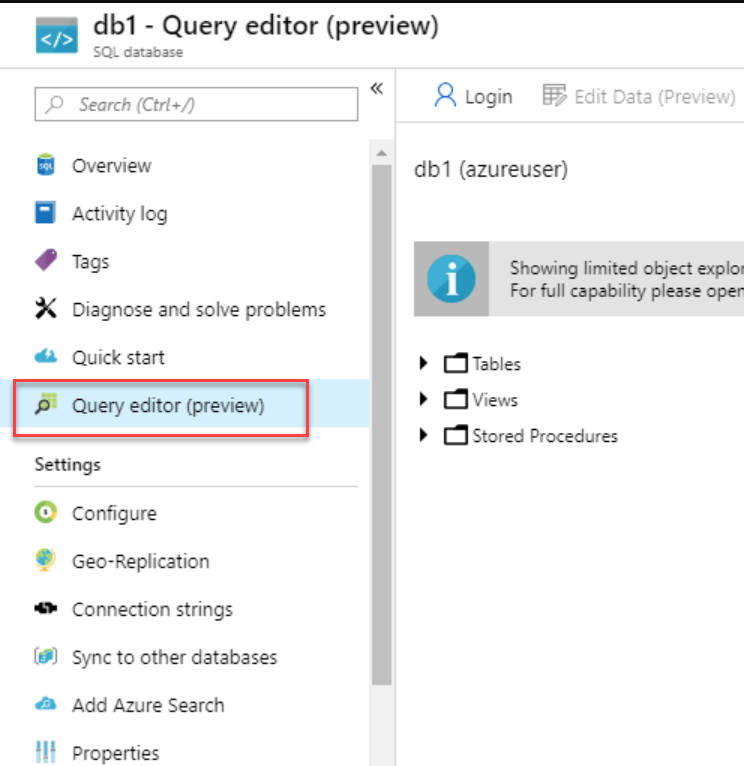
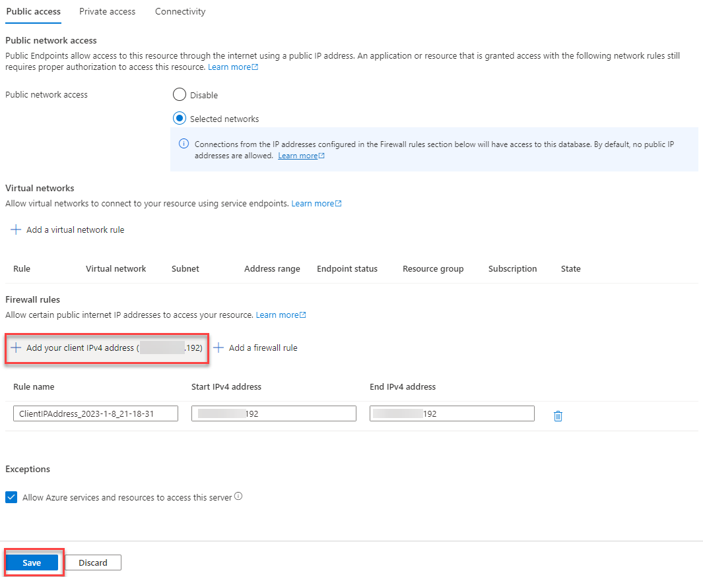

---
wts:
    title: '06 - Create a SQL database (10 min)'
    module: '02 - Azure Architecture & Services'
---

# 06 - Create a SQL database (10 min)

In this walkthrough, we will create a SQL database in Azure and then query the data in that database.

# Task 1: Create the database 

In this task, we will create a SQL database based on the AdventureWorksLT sample database. 

1. Sign in to the Azure portal at [**https://portal.azure.com**](https://portal.azure.com).

2. From the **All services** blade, search for and select **SQL databases**, and then click **+ Create**. 

3. On the **Basics** tab, fill in this information.  

    | Setting | Value | 
    | --- | --- |
    | Subscription | **Use default supplied** |
    | Resource group | Click on **Create new** <br /> Name: **06-sql-database** |
    | Database name| **db1** | 
    | Server | Select **Create new** (A new mask will open)|
    | Server name | **sqlserverxxxx** (must be unique) | 
    | Location | **(US) East US** |
    | Authentication method | **Use SQL authentication** |
    | Server admin login | **sqluser** |
    | Password | **Pa$$w0rd1234** |
    | Click  | **OK** |


4. On the  **Networking** tab and configure the following settings (leave others with their defaults) 

    | Setting | Value | 
    | --- | --- |
    | Connectivity method | **Public endpoint** |    
    | Allow Azure services and resources to access this server | **Yes** |
    | Add current client IP address | **No** |
    
   

5. On the **Security** tab. 

    | Setting | Value | 
    | --- | --- |
    | Microsoft Defender for SQL| **Not now** |
    
6. Move to the **Additional settings** tab. We will be using the AdventureWorksLT sample database. If you are asked whether Compute + Storage can be changed, confirm with OK. 

    | Setting | Value | 
    | --- | --- |
    | Use existing data | **Sample** |

    

7. Click **Review + create** and then click **Create** to deploy and provision the resource group, server, and database. It can take approx. 2 to 5 minutes to deploy.


# Task 2: Test the database.

In this task, we will configure the SQL server and run a SQL query. 

1. When the deployment has completed, click Go to resource from the deployment blade. Alternatively, from the **All Resources** blade, search and select **Databases**, then **SQL databases** ensure your new database was created. You may need to **Refresh** the page.

    

2. Click the **db1** entry representing the SQL database you created. On the db1 blade click **Query editor (preview)**.

    

3. Login as **sqluser** with the password **Pa$$w0rd1234**.

4. You will not be able to login. Read the error closely and make note of the IP address that needs to be allowed through the firewall. 

    

5. Back on the **db1** blade, click **Overview**. 

    

6. From the db1 **Overview** blade, click **Set server firewall** Located on the top center of the overview screen.

7. Click **+ Add client IP** (top menu bar) to add the IP address referenced in the error. (it may have autofilled for you - if not paste it into the IP address fields). Be sure to **Save** your changes. 

    

8. Return to your SQL database (slide the bottom toggle bar to the left) and click on **Query Editor (Preview)**. Try to login again as **sqluser** with the password **Pa$$w0rd1234**. This time you should succeed. Note that it may take a couple of minutes for the new firewall rule to be deployed. 

9. Once you log in successfully, the query pane appears. Enter the following query into the editor pane. 

    ```SQL
    SELECT TOP 20 pc.Name as CategoryName, p.name as ProductName
    FROM SalesLT.ProductCategory pc
    JOIN SalesLT.Product p
    ON pc.productcategoryid = p.productcategoryid;
    ```

    

10. Click **Run**, and then review the query results in the **Results** pane. The query should run successfully. The execution of the query can take up to 30 seconds the first time. 

    

Congratulations! You have created a SQL database in Azure and successfully queried the data in that database.

**Note**: To avoid additional costs, you can optionally remove this resource group. Search for resource groups, click your resource group, and then click **Delete resource group**. Verify the name of the resource group and then click **Delete**. Monitor the **Notifications** to see how the delete is proceeding.
