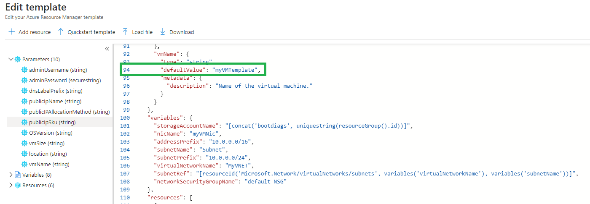
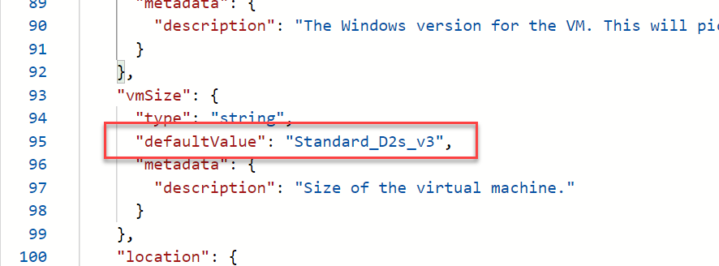

---
wts:
    title: '07 - Create a VM with a Template (10 min)'
    module: '03: Management Tools & Automation'
---
# 07 - Create a VM with a Template (10 min)

In this walkthrough, we will deploy a virtual machine with a QuickStart template and examine monitoring capabilities.

# Task 1: Explore the QuickStart gallery and locate a template 

In this task, we will browse the Azure QuickStart gallery and deploy a template that creates a virtual machine. 

1. Within the lab environment, open a new browser window, and enter https://github.com/Azure/azure-quickstart-templates/tree/master/quickstarts/microsoft.compute/vm-simple-windows.

2. Click the **Deploy to Azure** button. Your browser session will be automatically redirected to the [Azure portal](http://portal.azure.com/).

  **Note**: The **Deploy to Azure** button enables you to deploy the template via the Azure portal. During such deployment, you will be prompted only for small set of configuration parameters. 

3. When prompted, sign into your Azure subscription using the credentials provided earlier in the instructions.

4. Click **Edit template**. The Resource Manager template format uses the JSON format. Review the parameters and variables.  Then locate the parameter for virtual machine name. Change the name to **myVMTemplate**. Next locate the the parameter for vmSize and change it to **Standard_D2s_v3**. **Save** your changes. 

    vmName:
    

    vmSize:
    

5. Now configure the parameters required by the template (replace ***xxxx*** in the DNS label prefix with letters and digits such that the label is globally unique). Leave the defaults for everything else. 

    | Setting| Value|
    |----|----|
    | Subscription | **Keep default supplied**|
    | Resource group | Click on **Create new**   Name: **07-vm-template**|
    | Region | Keep default |
    | Admin username | **azureuser** |
    | Admin password | **Pa$$w0rd1234** |
    | DNS label prefix | **myvmtemplatexxxx** |
    | OS version | **2022-datacenter-azure-edition** |

6. Click **Review + Create**.

7. Monitor your deployment. 

# Task 2: Verify and monitor your virtual machine deployment

In this task, we will verify the virtual machine deployed correctly. 

1. From the **All services** blade, search for and select **Virtual machines**.

2. Ensure your new virtual machine was created. 

    

3. Select your virtual machine and on the **Overview** pane, select the **Monitoring** tab, scroll down to view monitoring data.

    **Note**: The monitoring timeframe can be adjusted from one hour to 30 days.

4. Review different charts that are provided including **CPU (average)**, **Network (total)**, and **Disk bytes (total)**. 

    

5. Click on any chart. Note that you can **Add metric** and change the chart type.

6. Return to the **Overview** blade. (slide toggle bar left)
7. Click on the **Activity log** (left pane). Activity logs record such events as creation or modification of resources. 

8. Click **Add filter**, and experiment with searching for different event types and operations. 

    

Congratulations! You have successfully created a resource from a template and deployed that template to Azure.

**Note**: To avoid additional costs, you can optionally remove this resource group. Search for resource groups, click your resource group, and then click **Delete resource group**. Verify the name of the resource group and then click **Delete**. Monitor the **Notifications** to see how the delete is proceeding.
