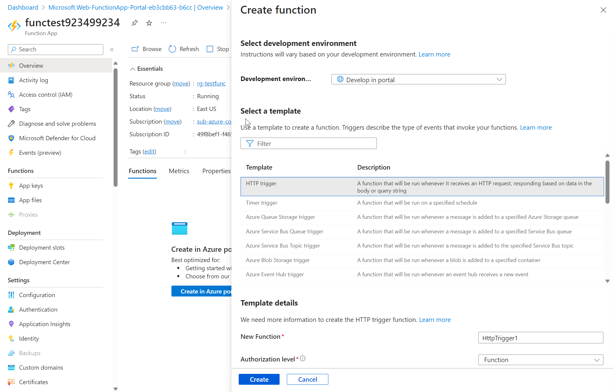
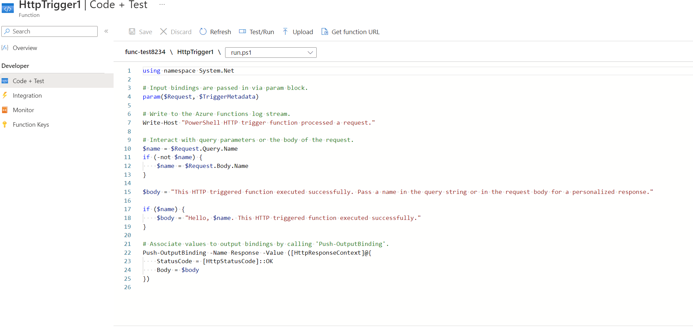
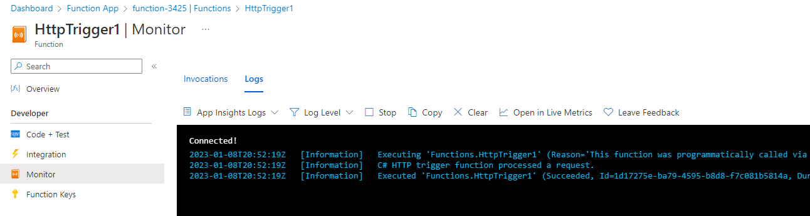

---
wts:
    title: '10 - Implement Azure Functions (5 min)'
    module: '03: Management Tools & Automation'
---
# 10 - Implement Azure Functions (5 min)

In this walkthrough, we will create a Function App to display a Hello message when there is an HTTP request. 

# Task 1: Create a Function app 

In this task, we will create a Function app.

1. Sign in to the [Azure portal](https://portal.azure.com).

2. In the **Search** bar at the top of the portal, search for and select **Function App** and then, from the **Function App** blade, click **+ Create**.

3. On the **Basic** tab of the **Function App** blade, specify the following settings (replace **xxxx** in the name of the function with letters and digits such that the name is globally unique and leave all other settings with their default values): 

    | Settings | Value |
    | -- | --|
    | Subscription | **Keep default supplied** |
    | Resource group | Click on **Create new**   Name: **10-function** |
    | Function App name | **function-xxxx** |
    | Publish | **Code** |
    | Runtime stack | **.NET** |
    | Version | **6** |
    | Region | **East US** |

    **Note** - Remember to change the **xxxx** so that it makes a unique **Function App name**

4. Click **Review + Create** and, after successful validation, click **Create** to begin provisioning and deploying your new Azure Function App.

5. Wait for the notification that the resource has been created.

6. When the deployment has completed, click **Go to resource** from the deployment blade. Alternatively, navigate back to the **Function App** blade, click **Refresh** and verify that the newly created function app has the **Running** status. 

    

# Task 2: Create a HTTP triggered function and test

In this task, we will use the Webhook + API function to display a message when there is an HTTP request. 

1. On the **Function App** blade, click the newly created function app. 

2. On the function app overview, Functions Tab click on **Create in Azure Portal**

    

3. An pop-up window will appear on the right. In the **Template** section click **HTTP trigger**. Click **Create** 

    

4. On the **HttpTrigger1** blade, in the **Developer** section, click **Code + Test**. 

5. On the **Code + Test** blade, review the auto-generated code and note that the code is designed to run an HTTP request and log information. Also, notice the function returns a Hello message with a name. 

    

6. Click **Get function URL** from the top section of function editor. 

7. Ensure that the value in the **Key** drop-down list is set to **default** and click **Copy** to copy the function URL. 

    

8. Open a new browser tab and paste the copied function URL into your web browser's address bar. When the page is requested the function will run. Notice the returned message stating that the function requires a name in the request body.

    

9. Append **&name=*yourname*** to the end of the URL.

    **Note**: For example, if your name is Cindy, the final URL will resemble the following: `https://azfuncxxx.azurewebsites.net/api/HttpTrigger1?code=X9xx9999xXXXXX9x9xxxXX==&name=cindy`

    

10. When you hit enter, your function runs and every invocation is traced. To view the traces, return to the Portal **HttpTrigger1 \| Code + Test** blade and click **Monitor**. You can open the **Logs** tab to get a live view. Open again the same URL as before. Now you should see an entry in the console. .

     

Congratulations! You have created a Function App to display a Hello message when there is an HTTP request.  

**Note**: To avoid additional costs, you can optionally remove this resource group. Search for resource groups, click your resource group, and then click **Delete resource group**. Verify the name of the resource group and then click **Delete**. Monitor the **Notifications** to see how the delete is proceeding.
