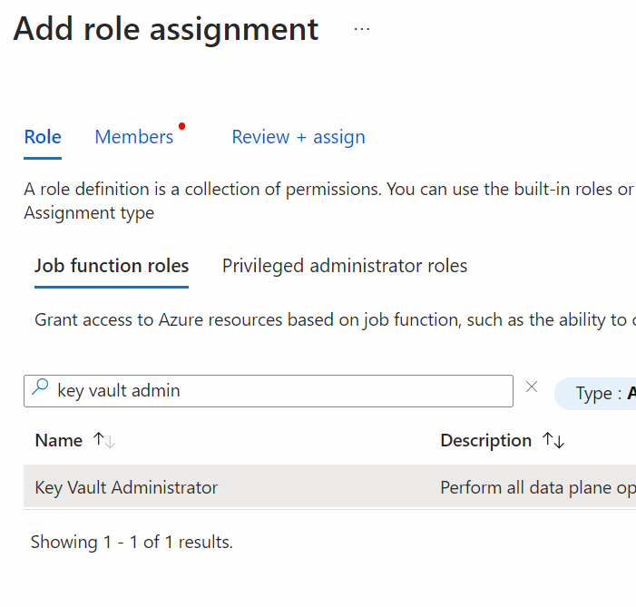
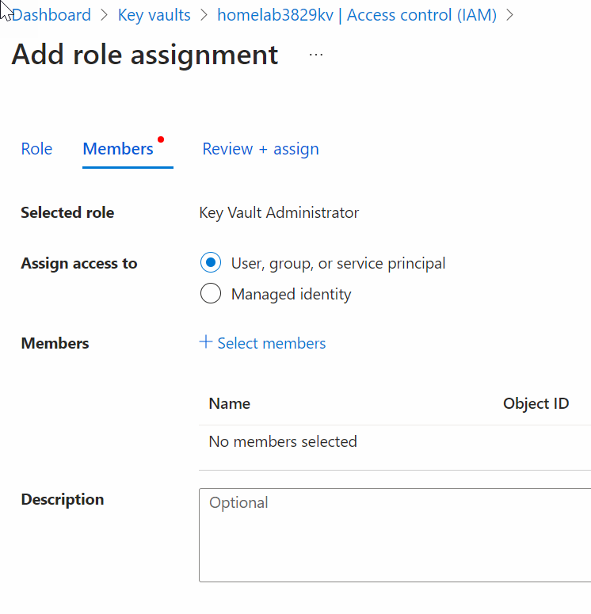

---
wts:
    title: '11 - Implement Azure Key Vault (5 min)'
    module: '04: Security & Network'
---
# 11 - Implement Azure Key Vault (5 min)

In this walkthrough, we will create an Azure Key vault and then create a password secret within that key vault, providing a securely stored, centrally managed password for use with applications.

# Task 1: Create an Azure Key Vault 

1. Sign in to the [Azure portal](https://portal.azure.com).

2. From the **All services** blade, search for and select **Key vaults**, then select **+Create**.

3. Configure the key vault (replace **xxxx** in the name of the key vault with letters and digits such that the name is globally unique). Leave the defaults for everything else.

    | Setting | Value | 
    | --- | --- |
    | Subscription | **Use default supplied** |
    | Resource group | Click on **Create new**   Name: **11-key-vault** |
    | Key vault name | **keyvaulttestxxxx** |
    | Location | **East US** |
    | Pricing tier | **Standard** |
    
    **Note** replace **xxxx** to find a unique name.
4. Click **Review + create**, and then click **Create**. 

5. Once the new key vault is provisioned, click **Go to resource**. Or you can locate your new key vault by searching for it. 

6. Click on the key vault **Overview** tab and take note of the **Vault URI**. Applications that use your vault through the REST APIs will need this URI.

# Task 2: Role Based Access Control

1. Locate **Access Control (IAM)** in den Submenu and click on **Add** / **Add Role Assignment**. 

    

2. Search for the role **Key Vault Administrator** and select it. Click on **next**. 

    

3. **Select members** and search for your admin Account. Add it to the Key Vault Administrator Group. Click on **Review & Assign** and finish this procedure. 

    

4. Take a moment to browse through some of the other key vault options. Under **Objects** review **Keys**, **Secrets**, **Certificates**, Under **Settings** review **Access configuration**, **Networking**.

    **Note**: Your Azure account is the only one authorized to perform operations on this new vault. You can modify this if you wish in the **Settings** and then the **Access policies** section.

# Task 3: Add a secret to the Key Vault
        
In this task, we will add a password to the key vault. 

1. Under **Objects** click **Secrets**, then click **+ Generate/Import**.

2. Configure the secret. Leave the other values at their defaults. Notice you can set an activation and expiration date. Notice you can also disable the secret.

    | Setting | Value | 
    | --- | --- |
    | Upload options | **Manual** |
    | Name | **ExamplePassword** |
    | Value | **hVFkk96** |

3. Click **Create**.

4. Once the secret has been successfully created, click on the **ExamplePassword**, and note it has a status of **Enabled**

5. Select the secret you just created, select the single secret entry under **Select Version** , note the the **Secret Identifier**. This is the url value that you can now use with applications. It provides a centrally managed and securely stored password. 

6. Click the button **Show Secret Value**, to display the password you specified earlier.

Congratulations! You have created an Azure Key vault and then created a password secret in that key vault, providing a securely stored, centrally managed password for use with applications.

**Note**: To avoid additional costs, you can optionally remove this resource group. Search for resource groups, click your resource group, and then click **Delete resource group**. Verify the name of the resource group and then click **Delete**. Monitor the **Notifications** to see how the delete is proceeding.
